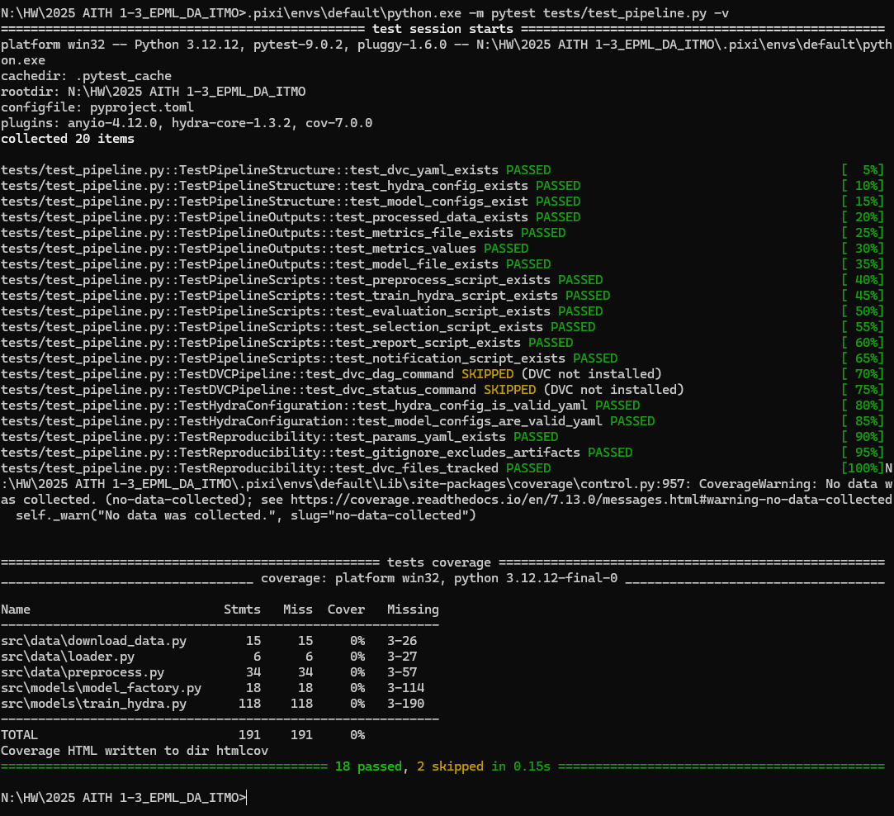
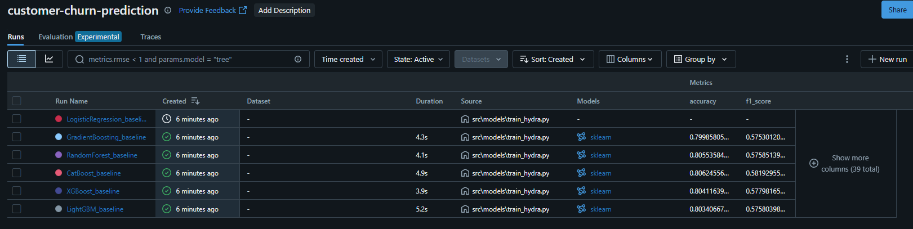
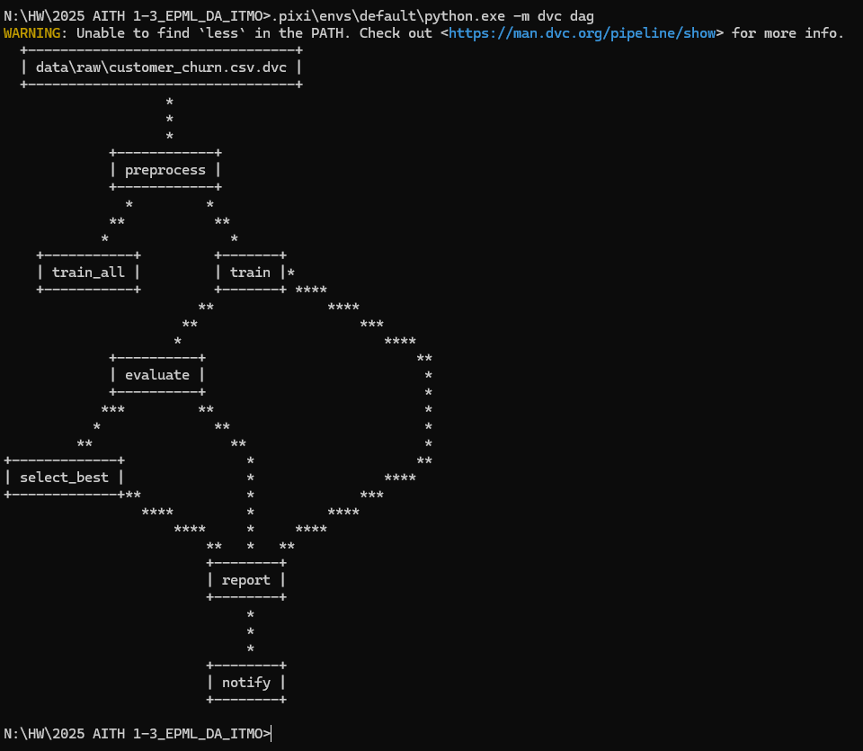

# Отчет HW_4: Автоматизация ML пайплайнов

## Выбор инструментов

**Оркестрация:** DVC Pipelines
**Конфигурации:** Hydra + OmegaConf

## Результаты

**Тесты:** 18/20 PASSED (2 skipped)
**Обучено моделей:** 5/6 (LogisticRegression - технические проблемы с установкой)
**MLflow эксперименты:** Все модели записаны с метриками


*Рисунок 1: Результаты тестирования pipeline*


*Рисунок 2: MLflow UI с результатами экспериментов*


*Рисунок 3: Граф зависимостей DVC pipeline*

## 1. Настройка оркестрации (4 балла)

### Установка

Зависимости в `pixi.toml`:
```toml
dvc = ">=3.64.1,<4"
mlflow = ">=2.9.0,<3.0"
hydra-core = ">=1.3.0,<2.0"
xgboost = ">=2.0.0,<3.0"
catboost = ">=1.2.0,<2.0"
```

### Pipeline

7 стадий в dvc.yaml:

- **preprocess** - препроцессинг
- **train** - обучение с Hydra
- **train_all** - все 6 моделей
- **evaluate** - оценка
- **select_best** - выбор лучшей
- **report** - генерация отчета
- **notify** - уведомления

Граф: preprocess → train → train_all → evaluate → select_best → report → notify

### Зависимости

DVC отслеживает автоматически через deps, outs, params, metrics.

Пример:

```yaml
train:
  cmd: python src/models/train_hydra.py
  deps:
    - src/models/train_hydra.py
    - data/processed/X_train.csv
    - conf/config.yaml
  outs:
    - models/lightgbm_model.pkl:
        cache: true
  metrics:
    - metrics.json:
        cache: false
```

### Кэширование

- `cache: true` - кэшировать
- `cache: false` - не кэшировать

Проверка: `dvc status`
Принудительно: `dvc repro --force`

## 2. Управление конфигурациями (3 балла)

### Структура Hydra

```
conf/
├── config.yaml
├── model/ (6 моделей)
├── data/default.yaml
├── training/default.yaml
└── experiment/ (3 типа)
```

### Главная конфигурация

`conf/config.yaml`:

```yaml
defaults:
  - model: lightgbm
  - data: default
  - training: default

project:
  name: customer-churn-prediction
  seed: 42

paths:
  models: models
  metrics: metrics.json

mlflow:
  tracking_uri: file:./mlruns
  enabled: true
```

### Модели

6 конфигураций: LightGBM, XGBoost, CatBoost, Random Forest, Gradient Boosting, Logistic Regression.

Пример `conf/model/lightgbm.yaml`:

```yaml
model:
  type: lightgbm
  params:
    num_leaves: 31
    learning_rate: 0.05
    n_estimators: 100
    random_state: ${project.seed}
```

### Валидация

- YAML автопроверка
- OmegaConf структура
- Тесты `tests/test_pipeline.py`

### Композиция

```bash
# модель
python src/models/train_hydra.py model=xgboost

# параметры
python src/models/train_hydra.py model=lightgbm model.params.n_estimators=200

# multirun
python src/models/train_hydra.py --multirun model=lightgbm,xgboost,catboost
```

## 3. Интеграция и тестирование (2 балла)

### Интеграция

Стек: DVC → Hydra → MLflow

Реализация `src/models/train_hydra.py`:

```python
@hydra.main(config_path="../../conf", config_name="config")
def train(cfg: DictConfig):
    setup_mlflow(cfg)
    with mlflow.start_run():
        model = create_model(cfg.model.type, cfg.model.params)
        model.fit(X_train, y_train)
        mlflow.log_metrics(metrics)
```

### Мониторинг

DVC:

```bash
dvc status
dvc metrics show
dvc dag
```

MLflow UI:

```bash
pixi run mlflow-ui  # http://127.0.0.1:5000
```

Автоотчеты:

- `src/pipelines/generate_report.py` → `reports/pipeline_report.md`
- `src/pipelines/evaluate_models.py` → `reports/evaluation/model_comparison.csv`

### Уведомления

`src/pipelines/notify.py` сохраняет статус в JSON:

```json
{
  "timestamp": "2024-12-15T14:30:00",
  "status": "success",
  "details": {
    "best_model": "lightgbm",
    "best_roc_auc": 0.8516
  }
}
```

### Тесты

`tests/test_pipeline.py` - 20+ тестов:

- TestPipelineStructure
- TestPipelineOutputs
- TestPipelineScripts
- TestDVCPipeline
- TestHydraConfiguration
- TestReproducibility

Запуск: `pytest tests/test_pipeline.py -v`

## 4. Созданные файлы

### Конфигурации (11 файлов)

- `conf/config.yaml`, `conf/model/*.yaml` (6), `conf/data/`, `conf/training/`, `conf/experiment/*.yaml` (3)

### Pipeline (7 файлов)

- `src/models/train_hydra.py`
- `src/pipelines/*.py` (6 скриптов)

### Документация (2 файла)

- `tests/test_pipeline.py`
- `REPORT_HW4.md`

### Обновлено (3 файла)

- `dvc.yaml` - 7 stages
- `pixi.toml` - зависимости
- `.gitignore` - директории

## 5. Воспроизведение
```bash
# 1. Установка
pixi install

# 2. Данные
pixi run python src/data/download_data.py

# 3. Весь pipeline
pixi run pipeline

# 4. MLflow UI (в отдельном терминале)
pixi run mlflow-ui

# 5. Просмотр результатов
pixi run dvc-metrics
pixi run dvc-dag
type reports\pipeline_report.md

# 6/ Тесты
pixi run python -m pytest tests/test_pipeline.py -v
```
## 6. Структура после HW_4

```
├── conf/              # Hydra
├── src/
│   ├── models/train_hydra.py
│   └── pipelines/     # 6 скриптов
├── tests/test_pipeline.py
├── reports/
│   ├── evaluation/
│   ├── notifications/
│   └── predictions/
├── models/best/
└── dvc.yaml           # 7 stages
```

## 7. Преимущества

### Автоматизация:

- `dvc repro` запускает весь pipeline
- Автоотслеживание зависимостей
- Кэширование результатов

### Гибкость:

- Модульные конфигурации
- CLI overrides

### Воспроизводимость:

- Фиксированный seed
- Версионирование (Git + DVC)
- 20+ тестов

### Мониторинг:

- DVC DAG
- MLflow UI
- Автоотчеты

## 8. Команды проверки

```bash
pixi install
python src/data/download_data.py
dvc repro
pixi run mlflow-ui
dvc dag
pixi run python -m pytest tests/test_pipeline.py -v
```
