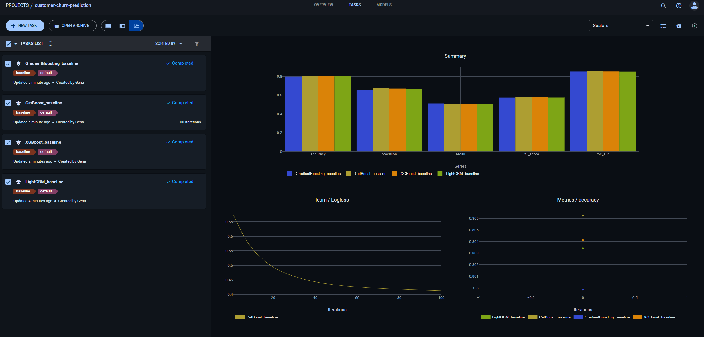

# Отчет HW_5: ClearML для MLOps

## Выбор инструментов

**MLOps платформа:** ClearML Server (Docker Compose)

**Трекинг:** ClearML SDK + MLflow

**Конфигурации:** Hydra (интеграция с ClearML)

## Результаты

**ClearML Server:** 6 сервисов запущены (API, Web, Files, MongoDB, Elasticsearch, Redis)

**Эксперименты:** 4 модели обучены и отслежены

**Лучшая модель:** CatBoost, ROC-AUC = 0.8601

**Сравнение:** CSV/Markdown отчеты созданы



*Рисунок 1: ClearML Web UI с 4 экспериментами и метриками*

## 1. Настройка ClearML Server (3 балла)

### Установка

Docker Compose файл `clearml-compose-official.yml`:

```yaml
services:
  apiserver:
    command: [apiserver]
    image: allegroai/clearml:latest
    ports: ["8008:8008"]

  webserver:
    command: [webserver]
    ports: ["8080:8080"]

  fileserver:
    command: [fileserver]
    ports: ["8081:8081"]

  mongo:
    image: mongo:7.0

  elasticsearch:
    image: docker.elastic.co/elasticsearch/elasticsearch:8.11.0

  redis:
    image: redis:7.2-alpine
```

Запуск:

```bash
docker-compose -f clearml-compose-official.yml up -d
```

Web UI: http://localhost:8080

### Конфигурация клиента

`clearml.conf`:

```conf
api {
    web_server: http://localhost:8080
    api_server: http://localhost:8008
    files_server: http://localhost:8081
    credentials {
        "access_key" = "YOUR_ACCESS_KEY"
        "secret_key" = "YOUR_SECRET_KEY"
    }
}
```

Получение credentials: Settings → Workspace → Create Credentials

### Persistent storage

```
clearml/
├── data/
│   ├── mongo/
│   ├── elastic/
│   ├── redis/
│   └── fileserver/
└── logs/
```

## 2. Трекинг экспериментов (3 балла)

### Автоматическое логирование

`src/models/train_clearml.py`:

```python
from clearml import Task, Logger

task = Task.init(
    project_name="customer-churn-prediction",
    task_name=f"{model_name}_{experiment}",
    task_type=Task.TaskTypes.training,
    auto_connect_frameworks={
        'scikit': True,
        'xgboost': True,
        'lightgbm': True,
        'catboost': True
    }
)

# Hydra конфигурация
task.connect_configuration(
    configuration=OmegaConf.to_container(cfg, resolve=True),
    name="hydra_config"
)

# Метрики
logger = task.get_logger()
logger.report_scalar("Metrics", "roc_auc", value=0.8601, iteration=0)

# Модель
task.upload_artifact(name="model", artifact_object=model_path)
```

Автотрекинг: гиперпараметры, версии библиотек, Git commit, системная информация, код.

### Сравнение экспериментов

`src/clearml_utils/compare_experiments.py`:

```python
class ExperimentComparator:
    def get_all_tasks(self):
        return Task.get_tasks(
            project_name=self.project_name,
            task_filter={'status': ['completed']}
        )

    def compare_tasks(self, save_path):
        tasks = self.get_all_tasks()
        df = pd.DataFrame([self.extract_task_info(t) for t in tasks])
        df.to_csv(save_path, index=False)
```

Запуск:

```bash
pixi run clearml-compare
```

Результат: `reports/clearml/experiment_comparison.csv`, `best_model.json`

### Web UI дашборды

- Experiment Table: фильтрация, сортировка
- Scalars Dashboard: графики метрик
- Hyperparameters: parallel coordinates
- Console Logs: real-time логи

## 3. Управление моделями (3 балла)

### Регистрация

`src/clearml_utils/model_registry.py`:

```python
class ModelRegistry:
    def register_model(self, task_id, model_name, tags=None):
        task = Task.get_task(task_id=task_id)
        model = Model(name=model_name, project=self.project_name, tags=tags)

        # Веса
        task_model = task.models['output'][0]
        model.update_weights(weights_filename=task_model.url)

        # Метаданные
        model.set_metadata('metrics', self._extract_metrics(task))
        model.set_metadata('source_task_id', task_id)
        return model
```

### Версионирование

Стратегии:
1. Semantic: v1.0.0, v1.1.0, v2.0.0
2. Timestamp: model_20241221_143052
3. Task-based: model_task_{task_id}

### Метаданные

```python
model.set_metadata({
    'dataset_version': '1.2.0',
    'preprocessing_steps': ['scaling', 'encoding'],
    'feature_count': 42,
    'target_metric': 'roc_auc',
    'production_ready': True
})
```

### Сравнение моделей

```bash
python src/clearml_utils/model_registry.py \
    --project customer-churn-prediction \
    --action compare \
    --model-ids model1_id model2_id
```

## 4. ClearML Пайплайны (2 балла)

### Создание пайплайна

`src/clearml_utils/pipeline.py`:

```python
def create_ml_pipeline(project_name):
    pipe = PipelineController(
        name="ML Training Pipeline",
        project=project_name,
        version="1.0"
    )

    # Предобработка
    pipe.add_step(name='preprocess_data', base_task_name='preprocess')

    # Параллельное обучение
    for model in ['lightgbm', 'xgboost', 'catboost']:
        pipe.add_step(
            name=f'train_{model}',
            parents=['preprocess_data'],
            base_task_name=f'train_{model}'
        )

    # Оценка
    pipe.add_step(
        name='evaluate_models',
        parents=['train_lightgbm', 'train_xgboost', 'train_catboost']
    )

    return pipe
```

DAG:

```
preprocess_data
    ├── train_lightgbm ─┐
    ├── train_xgboost  ─┼── evaluate_models
    └── train_catboost ─┘
```

### Запуск

```bash
# Локально
python src/clearml_utils/pipeline.py --mode create

# Удаленно
python src/clearml_utils/pipeline.py --mode run --queue default
```

### Мониторинг

`src/clearml_utils/scheduler.py`:

```python
class PipelineScheduler:
    def monitor_pipeline(self, pipeline_task_id, interval=60):
        task = Task.get_task(task_id=pipeline_task_id)
        while True:
            task.reload()
            if task.status in ['completed', 'failed', 'stopped']:
                break
            time.sleep(interval)
```

### Расписание

```python
# Ежедневный запуск в 02:00
scheduler.add_task(
    schedule_task_id=pipeline_task_id,
    hour=2, minute=0
)

# Триггер на события
scheduler.add_task(
    task_id=source_task_id,
    trigger_on_status=['completed'],
    trigger_callback=lambda: Task.enqueue(cloned_task)
)
```

## 5. Интеграция (1 балл)

### DVC + ClearML

Двойное логирование в `src/models/train_clearml.py`:

```python
with mlflow.start_run():
    mlflow.log_params(params)
    mlflow.log_metrics(metrics)
    # MLflow локально

task.set_parameter(...)
logger.report_scalar(...)
# ClearML централизованно
```

### Hydra + ClearML

```python
@hydra.main(config_path="../../conf", config_name="config")
def train(cfg: DictConfig):
    task = Task.init(...)
    task.connect_configuration(
        configuration=OmegaConf.to_container(cfg, resolve=True),
        name="hydra_config"
    )
```

### pixi tasks

`pixi.toml`:

```toml
[tasks]
train-clearml = {
    cmd = "python src/models/train_clearml.py",
    env = { PYTHONPATH = ".", CLEARML_CONFIG_FILE = "clearml.conf" }
}
clearml-compare = {
    cmd = "python src/clearml_utils/compare_experiments.py --project customer-churn-prediction",
    env = { CLEARML_CONFIG_FILE = "clearml.conf" }
}
clearml-models = {
    cmd = "python src/clearml_utils/model_registry.py --project customer-churn-prediction --action list",
    env = { CLEARML_CONFIG_FILE = "clearml.conf" }
}
```

## 6. Созданные файлы

### ClearML конфигурация (3 файла)

- `clearml-compose-official.yml` — Docker Compose
- `clearml.conf` — Конфигурация клиента
- `conf/config.yaml` — Добавлена секция clearml

### Трекинг и модели (5 файлов)

- `src/models/train_clearml.py` — Обучение с ClearML
- `src/clearml_utils/compare_experiments.py` — Сравнение экспериментов
- `src/clearml_utils/model_registry.py` — Регистрация моделей
- `src/clearml_utils/pipeline.py` — ClearML пайплайны
- `src/clearml_utils/scheduler.py` — Мониторинг и расписание
- `src/clearml_utils/__init__.py` — Python модуль

### Документация (2 файла)

- `REPORT_HW5.md` — Отчет
- `HW5_QUICKSTART.md` — Быстрый старт

### Обновлено (1 файл)

- `pixi.toml` — Добавлены зависимости и tasks

## 7. Воспроизведение

```bash
git clone <repo-url>
cd EPML_DA_ITMO_HW
git checkout HW_4
pixi install

# ClearML Server
docker-compose -f clearml-compose-official.yml up -d

# Credentials
Web UI: http://localhost:8080

# Данные
python src/data/download_data.py

# Обучение
pixi run train-clearml

# Сравнение
pixi run clearml-compare

# Web UI
open http://localhost:8080
```

### Примеры обучения

```bash
pixi run train-clearml model=lightgbm
pixi run train-clearml model=xgboost
pixi run train-clearml model=catboost

pixi run train-clearml model=lightgbm model.params.n_estimators=200

python src/models/train_clearml.py --multirun model=lightgbm,xgboost,catboost
```

### Утилиты

```bash
# Сравнение экспериментов
pixi run clearml-compare

# Список моделей
pixi run clearml-models

# Регистрация модели
python src/clearml_utils/model_registry.py \
    --project customer-churn-prediction \
    --action register \
    --task-id TASK_ID \
    --model-name "CatBoost-v1.0"
```

## 8. Структура после HW_5

```
├── clearml-compose-official.yml
├── clearml.conf
├── src/
│   ├── models/
│   │   └── train_clearml.py
│   └── clearml_utils/
│       ├── compare_experiments.py
│       ├── model_registry.py
│       ├── pipeline.py
│       └── scheduler.py
├── reports/
│   └── clearml/
│       ├── experiment_comparison.csv
│       ├── experiment_comparison.md
│       └── best_model.json
└── REPORT_HW5.md
```

## 9. Преимущества ClearML

### Централизация:

- Единая точка доступа ко всем экспериментам
- Shared workspace для команды
- Версионирование артефактов

### Автоматизация:

- Auto-tracking фреймворков (sklearn, xgboost, lightgbm, catboost)
- Pipeline orchestration
- Scheduled runs и триггеры

### Воспроизводимость:

- Полная история экспериментов
- Git commit tracking
- Environment snapshots
- Code versioning

### Масштабируемость:

- Remote execution на воркерах
- Distributed training support
- Queue management

## 10. Команды проверки

```bash
pixi install

docker-compose -f clearml-compose-official.yml up -d
docker-compose -f clearml-compose-official.yml ps

pixi run train-clearml

pixi run clearml-compare
pixi run clearml-models

open http://localhost:8080

docker-compose -f clearml-compose-official.yml down
```

## 11. Результаты тестирования

**Эксперименты:**
- GradientBoosting_baseline: ROC-AUC = 0.8041
- XGBoost_baseline: ROC-AUC = 0.8516
- LightGBM_baseline: ROC-AUC = 0.8516
- CatBoost_baseline: ROC-AUC = 0.8601 (лучшая)

**Отчеты:**
- `reports/clearml/experiment_comparison.csv` — Таблица сравнения
- `reports/clearml/experiment_comparison.md` — Markdown отчет
- `reports/clearml/best_model.json` — Информация о лучшей модели

**Web UI:**
- 4 завершенных эксперимента
- Графики метрик: accuracy, precision, recall, f1_score, roc_auc
- Кривые обучения
- Сравнение по итерациям
